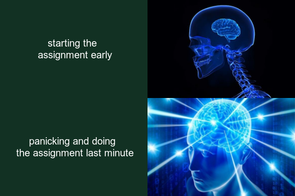

# Hello

Hi, this is my website.

Contents:

1. About Markdown
2. My meme
3. Explanation

## About Markdown

*Markdown is cool*

Markdown files:

* use the extension .md
* are turned into webpages through GitHub Pages


## My meme

This is the meme I have created:



And this is the **R code** I used:

```
library(magick)

topleft <- image_blank(width = 300, height = 200, color="#123123") %>%
  image_annotate(text="starting the \n assignment early", color = "#FFFFFF", size = 20, font = "trebuchet", gravity = "center")
  
smallbrain <- image_read("https://i.kym-cdn.com/photos/images/newsfeed/001/232/375/3fb.jpg") %>%
  image_scale("300x200!")

bottomleft <- image_blank(width = 300, height = 200, color="#123123") %>%
  image_annotate(text="panicking and doing \n the assignment last minute", color = "#FFFFFF", size = 20, font = "trebuchet", gravity = "center")

expandingbrain <- image_read("https://mat3e.github.io/brains/img/3.jpg") %>%
  image_scale("300x200!")

row1 <- image_append(c(topleft, smallbrain))
row2 <- image_append(c(bottomleft, expandingbrain))

meme <- c(row1, row2) %>%
  image_append(stack = TRUE)

image_write(meme, "meme.png")

```

## Explanation

This meme uses the Galaxy Brain (or Expanding Brain) meme template, which originated around the start of 2017. It is used here in an ironic way, asserting that it is smart to start doing your assignment late, even though this is generally not a good idea.

The "meme wiki" website, Know Your Meme, states that:

> Though the expanding brain is usually implied to showcase intellectual superiority over various objects, it is more often used in an ironic sense to imply the opposite, where objects of derision are implied to be of higher standard than objects that are usually highly regarded.

Another example of a meme with this format, created by someone else, is


